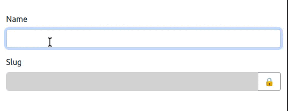

# Leapt SlugType bundle

[](https://packagist.org/packages/leapt/slug-type-bundle)
[](https://github.com/leapt/slug-type-bundle/actions?query=workflow%3A%22Continuous+Integration%22)

[](LICENSE)
[](https://codecov.io/gh/leapt/slug-type-bundle/branch/1.x)

Leapt SlugType bundle makes a form field dynamically generate the slug based on the content of another text field.



## Requirements

- PHP ^8.2
- Symfony ^6.2
- Webpack Encore & Stimulus bridge already present in your project

## Installation

```bash
composer require leapt/slug-type-bundle

# Don't forget to install the JavaScript dependencies as well and compile
npm install --force
npm run watch

# or use yarn
yarn install --force
yarn watch
```

Then, in your Twig configuration, add the form theme you want to apply:

```yaml
# config/packages/twig.yaml
twig:
    form_themes:
        - '@LeaptSlugType/bootstrap5_layout.html.twig'
```

There are currently 3 form themes available:

- `@LeaptSlugType/basic_layout.html.twig`
- `@LeaptSlugType/bootstrap4_layout.html.twig`
- `@LeaptSlugType/bootstrap5_layout.html.twig`

## Usage

In your form type, use the `SlugType` on the field that will handle the slug, and give it a `target` option that will be
used to generate the slug:

```php
<?php

namespace App\Form\Type;

use Leapt\SlugTypeBundle\Form\SlugType;
use Symfony\Component\Form\AbstractType;
use Symfony\Component\Form\Extension\Core\Type\TextType;
use Symfony\Component\Form\FormBuilderInterface;

final class CenterType extends AbstractType
{
    public function buildForm(FormBuilderInterface $builder, array $options): void
    {
        $builder
            ->add('name', TextType::class)
            ->add('slug', SlugType::class, [
                'target' => 'name',
            ])
        ;
    }
}
```

By default, for Bootstrap 4 & 5 themes, a `btn-secondary` class is applied to the lock button. You can change it
by using the `button_class` option for any form theme:

```php
$builder->add('slug', SlugType::class, [
    'target' => 'name',
    'button_class' => 'btn-warning',
]);
```

You can also customize the locked & unlocked icons. By default, it uses emojis, but if you use e.g. FontAwesome you can
override it:

```php
$builder->add('slug', SlugType::class, [
    'target' => 'name',
    'locked_icon' => '<i class="fas fa-fw fa-lock"></i>',
    'unlocked_icon' => '<i class="fas fa-fw fa-lock-open"></i>',
]);
```

## Contributing

Feel free to contribute, like sending [pull requests](https://github.com/leapt/slug-type-bundle/pulls) to add
features/tests or [creating issues](https://github.com/leapt/slug-type-bundle/issues) :)

Note there are a few helpers to maintain code quality, that you can run using these commands:

```bash
composer cs:dry # Code style check
composer cs:fix # Fix code style
composer phpstan # Static analysis
composer phpunit # Run tests

# Or run all cs:dry, phpstan & phpunit scripts using the following:
composer ci
```
